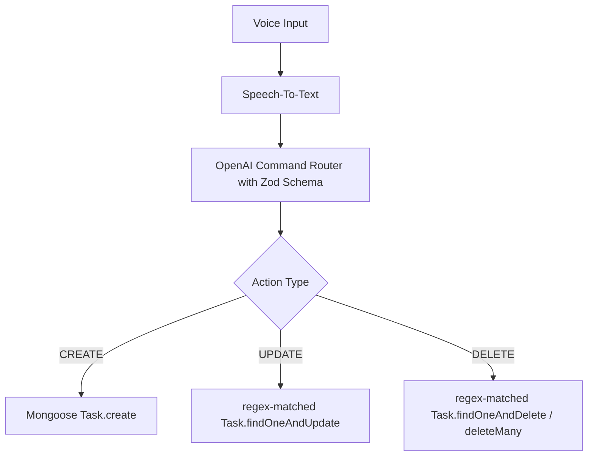

# 🌟 Voithos: AI-Powered Personal Organizer

 sideKick cum Assistant cum buddy  is a one who will be helping you to optimize your work and day to day life and will take you to the heights that you dreams everyday. IT's a feature-rich smart personal organizer built using the **MERN (MongoDB, Express, React, Node.js) stack**. Driven by a conversational AI companion (Ayra or Jordan) and integrated with Google Calendar and browser push notification APIs, it transforms standard task management into an automated, speech-guided scheduler (don't think just say what you want do today rest is your buddy work ).

---

## 🚀 Key Features & Capabilities

### 🎙️ 1. Smart Conversational AI Assistant
* **AI Companions:** Choose your dedicated AI agent (**Ayra** or **Jordan**) during registration.
* **Brain-Dump Mode:** Click the voice sphere to talk naturally. The assistant automatically listens, transcribes, and extracts your tasks.
* **Stateful Pause Detection:** Utilizes the Web Speech API on the frontend. If a user pauses for 20 seconds, the assistant speaks back: *"Is there anything left, Sir or Ma'am?"*
* **Automatic Rollover:** If the user finishes adding new tasks, the backend checks yesterday's unfinished tasks. It congratulates the user if everything was finished, or asks if they would like to roll outstanding items over to today's view.

### ⚡ 2. OpenAI Dynamic Command Router
* **Multi-Intent Parsing:** Uses GPT-4 and Zod structured outputs (`zodResponseFormat`) to decode single or multiple actions from a single audio command.
* **Action Routing:** Resolves user inputs into `CREATE`, `UPDATE` (e.g., set priority, change time, mark done), or `DELETE` commands.
* **Target Scoping:** Distinguishes between `SINGLE_TASK` edits (using regex keyword matching) and `ENTIRE_DAY` changes (e.g., *"Cancel everything I have planned for today"*).
###  3. History 
* **Have you history:** it have the list of all the task that you have in your week for being sure that you have not forgot any thing .


### ⚡ 4. First Notification 
* **NOtification:** you will have the notification of daily planing on the morning or the night according to which person you are day or night.



### 📅 5. Unified Aggregated Calendar Feed
* **Dual Pipelines:** Blends internal tasks (Mongoose query filtered by `dueDate`) with real-time Google Calendar events fetched via OAuth2 tokens.
* **Interactive Timeline:** Built using a customized FullCalendar layout showing tasks, deadlines, and external events.
* **Drag-and-Drop Rescheduling:** Dragging a calendar block updates its date in MongoDB (for local tasks) or pushes the date change upstream to Google's API (for external events).

### 🔔 6. Scheduled Push Notifications
* **Browser Service Workers:** Desktop & mobile push notifications sent directly to the operating system notification drawer using a custom background Service Worker (`sw.js`).
* **Cron-Scheduled Prompts:** A background `node-cron` worker queries user preferences twice a day:
  * **Morning Prompt (7:00 AM):** Reminds users to dump tasks and plan their day.
  * **Night Reflection (10:00 PM):** Encourages users to jot down tomorrow's tasks.

### 🚨 7. Persistent Snooze & Reminder Loop
* **Recursive Engine:** When an alarm time strikes, the backend fires a push notification with a custom sound asset.
* **Persistent Nagging:** If the user doesn't mark the task as **Done**, a background timeout loop runs every 5 minutes, resending the notification.
* **Auto-Escape:** The snooze loop terminates instantly the moment the task status switches to `isCompleted: true` in MongoDB.

### 📋 8. Task Management, Collaboration & Attachments
* **Task Customization:** Assign priority (High/Medium/Low), due dates, and specific times.
* **File Attachments:** Upload files (up to 50MB) directly to task items via a built-in Multer integration.
* **Collaborators:** Share tasks with other users by adding their emails to create collaborative workflows.
* **Modern Themes:** Sleek dark-mode (default) and light-mode themes with glassmorphic cards and dynamic micro-animations.

---

## 📂 Repository Directory Structure

```text
PersonalAsis(Todo)/
├── backend/
│   ├── config/                  # Database connectivity setup
│   ├── controllers/             # Express controllers (auth, task, voice, Google)
│   ├── middleware/              # Auth guard token authentication
│   ├── models/                  # Mongoose Schemas (User, Task)
│   ├── routes/                  # Express routing table (api.js)
│   ├── workers/                 # node-cron worker & recursive snooze loops
│   ├── uploads/                 # Task attachment storage directory
│   ├── .env                     # Backend environment variables
│   ├── server.js                # Core app configuration & startup script
│   └── package.json
│
├── frontend/
│   ├── public/                  # Static assets & Service Worker (sw.js)
│   ├── src/
│   │   ├── assets/              # Shared image/sound resources
│   │   ├── components/          # Dashboard subcomponents (Calendar, Tasks, Voice)
│   │   ├── pages/               # Onboarding survey, profile settings, auth forms
│   │   ├── App.jsx              # Main routing & application state wrapper
│   │   ├── index.css            # Root design token configuration
│   │   └── main.jsx
│   ├── vite.config.js
│   └── package.json
│
└── implementation plan.md       # Original design blueprints and code specs
```

---

## 🛠️ Tech Stack

* **Frontend:** React (Vite), FullCalendar (`@fullcalendar/react`), Lucide React Icons, Axios.
* **Backend:** Node.js, Express, MongoDB (Mongoose), Multer, Web-Push, Node-Cron.
* **AI:** OpenAI Node SDK (GPT-4), Zod (Response formatting validation).
* **Authentication:** JWT (JSON Web Tokens), Cookie-Parser, Google OAuth 2.0 (googleapis client).

---

## ⚙️ Setup & Installation

### Prerequisites
* Node.js (v18+ recommended)
* MongoDB database instance (local or Atlas)
* OpenAI API Key
* Google Cloud Console Credentials (for calendar sync)

### 1. Configure the Backend
Navigate to the `/backend` folder:
```bash
cd backend
npm install
```

Create a `.env` file in the `/backend` directory and configure the variables:
```env
PORT=5000
MONGO_URI=your_mongodb_connection_string
JWT_SECRET=your_jwt_signing_key
OPENAI_API_KEY=your_openai_api_key

# Web Push VAPID Keys (Generate using `npx web-push generate-vapid-keys`)
PUBLIC_VAPID_KEY=your_public_vapid_key
PRIVATE_VAPID_KEY=your_private_vapid_key

# Google OAuth2 Credentials
GOOGLE_CLIENT_ID=your_google_client_id
GOOGLE_CLIENT_SECRET=your_google_client_secret
GOOGLE_REDIRECT_URL=http://localhost:5000/api/integrations/google/callback

# Frontend Origin URL
FRONTEND_URL=http://localhost:5173
```

Run the backend server:
* Development mode (with nodemon): `npm run dev`
* Production mode: `npm start`

---

### 2. Configure the Frontend
Navigate to the `/frontend` folder:
```bash
cd ../frontend
npm install
```

Ensure your backend endpoint URL inside `frontend/src/App.jsx` matches your running backend instance (defaults to `http://localhost:5000`).

Ensure a `default-reminder.mp3` or `custom-alert.mp3` sound is added in the `frontend/public/sounds/` folder to enable custom sound alerts for push reminders.

Run the frontend server:
* Run local Vite server: `npm run dev`
* Build production bundle: `npm run build`

---

## 📝 Core Technical Architectures

### Zod Intent Schema (Voice Processing)
The OpenAI API utilizes this Zod definition to parse incoming transcripts into clean database updates:

```javascript
const VoiceActionSchema = z.object({
  actionType: z.enum(["CREATE", "UPDATE", "DELETE"]),
  targetScope: z.enum(["SINGLE_TASK", "ENTIRE_DAY"]),
  targetSearchQuery: z.string().optional(),
  targetDate: z.string().optional(),
  taskPayload: z.object({
    taskTitle: z.string().optional(),
    dueDate: z.string().optional(),
    dueTime: z.string().optional(),
    priority: z.enum(["high", "medium", "low"]).optional(),
    isCompleted: z.boolean().optional()
  }).optional()
});
```

### Persistent Snooze Worker Loop
If a task is past its due time and is not marked completed, this backend loop recursively calls itself every 5 minutes:

```javascript
export const triggerSnoozeNotificationLoop = async (taskId) => {
  const task = await Task.findById(taskId);
  if (!task || task.isCompleted) return; // Terminate recursion

  const user = await User.findById(task.userId);
  if (!user || !user.pushSubscription) return;

  const payload = JSON.stringify({
    taskId: task._id,
    title: `🚨 Persistent Reminder`,
    body: `Your task "${task.title}" requires action!`,
    soundUrl: '/sounds/custom-alert.mp3'
  });

  await webpush.sendNotification(user.pushSubscription, payload);

  // Recurse in 5 minutes
  setTimeout(() => {
    triggerSnoozeNotificationLoop(taskId);
  }, 5 * 60 * 1000);
};
```

---

## 🛡️ License
This project is private and configured for personal assistant task automation.
